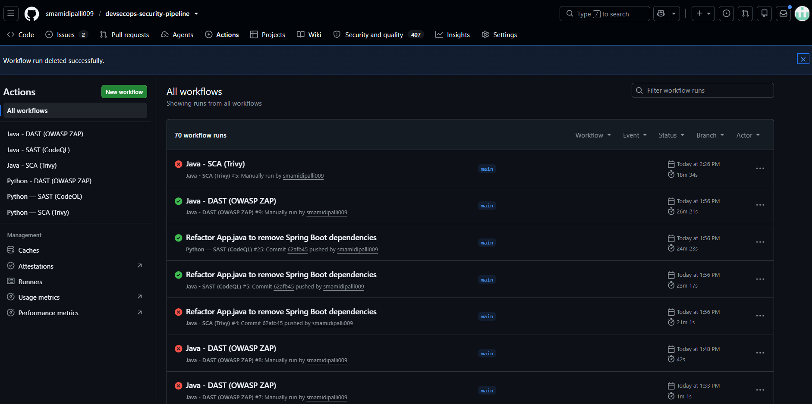
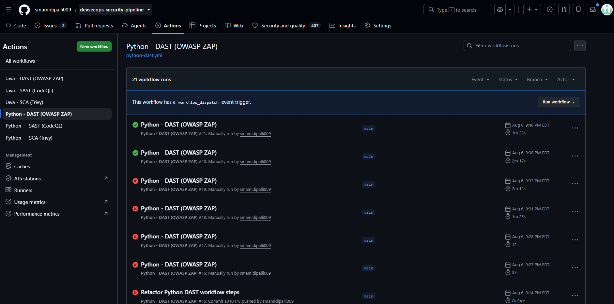
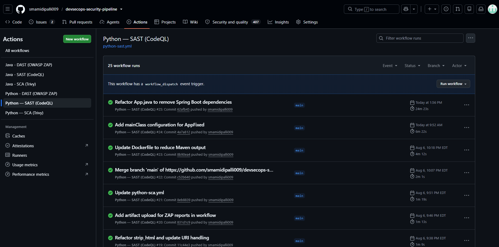
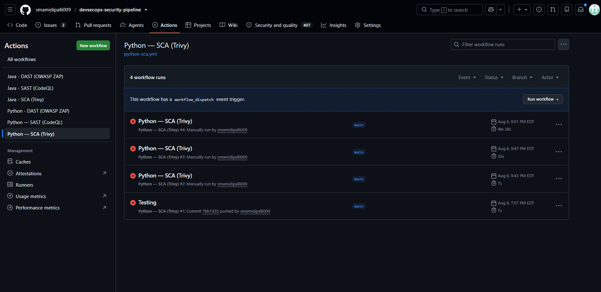
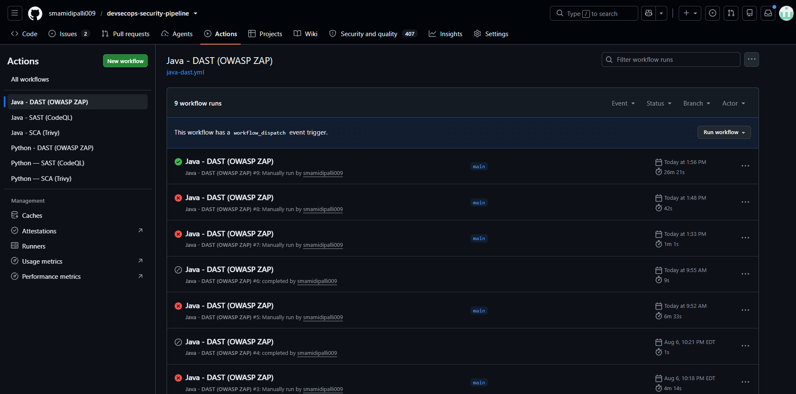
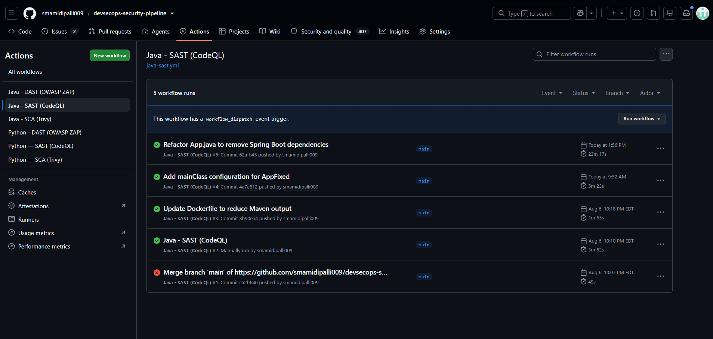
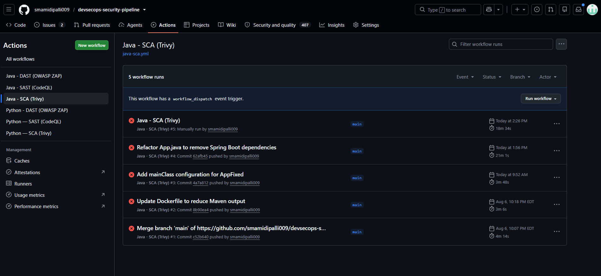
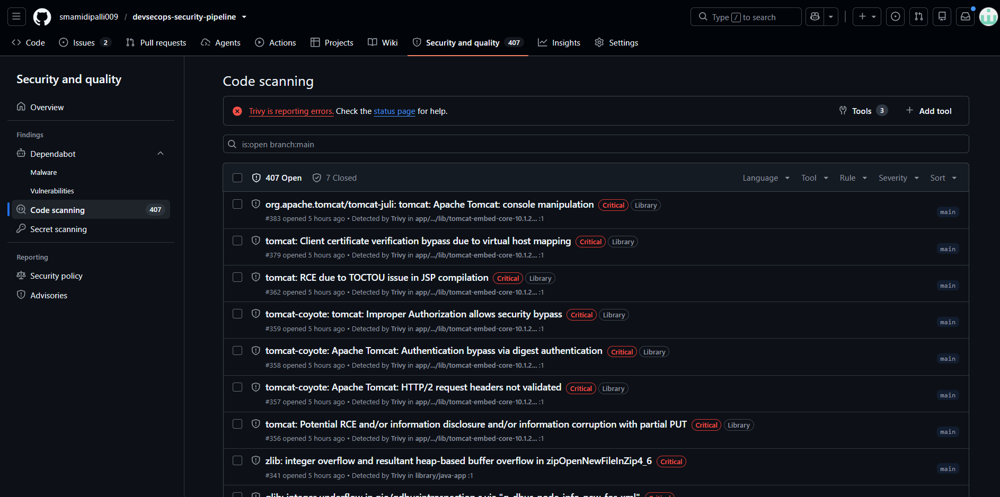
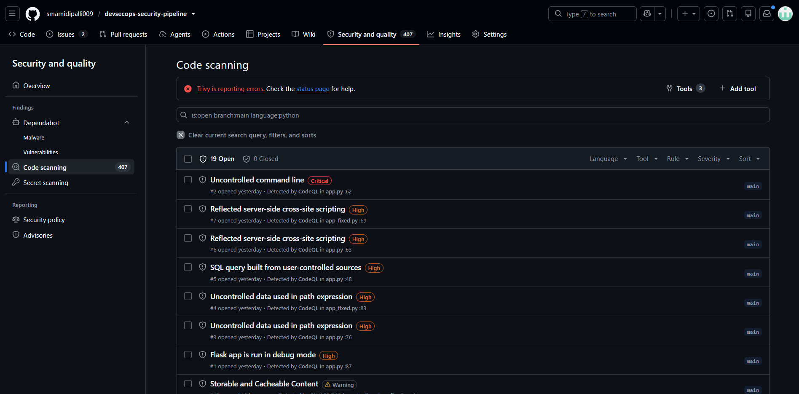
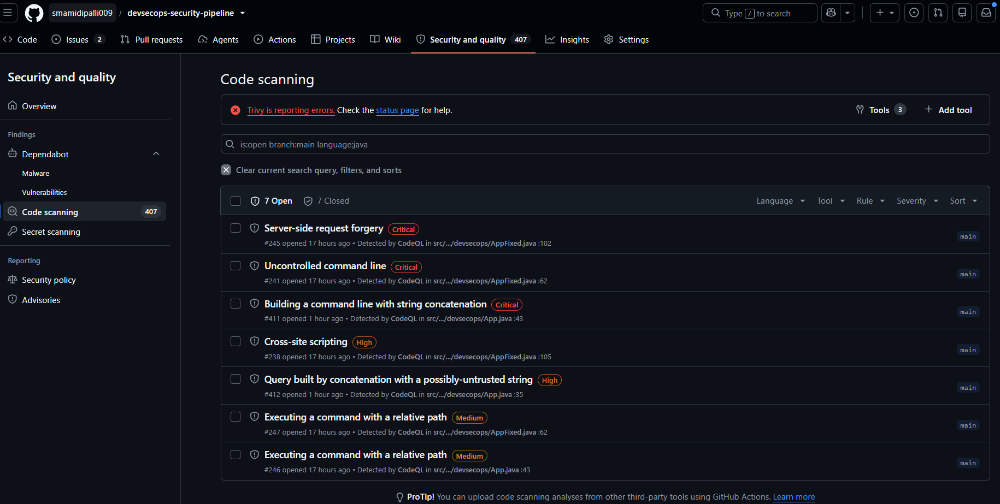

# DevSecOps Security Pipeline


An end-to-end DevSecOps pipeline covering all three core security testing
layers — **SAST**, **SCA**, and **DAST** — across multiple languages, with
separate, independently triggerable workflow files per language per layer.

---

## Pipeline overview

```
Code push
    │
    ├── SAST (CodeQL)    → scans source code for vulnerabilities
    │                      Requires build step for Java
    │
    ├── SCA  (Trivy)     → builds Docker image, scans for CVEs
    │                      Gates build on HIGH/CRITICAL fixable vulns
    │                      Generates SBOM, pushes to GHCR if clean
    │
    └── DAST (OWASP ZAP) → spins up container → ZAP scans live app
                           Finds runtime issues: missing headers,
                           exposed endpoints, misconfigured CORS
```

---

## Current status

| Language | SAST | SCA | DAST | Docker | Framework |
|---|---|---|---|---|---|
| **Python** | ✅ CodeQL | ✅ Trivy | ✅ OWASP ZAP | ✅ Distroless | Flask |
| **Java** | ✅ CodeQL | ✅ Trivy | ✅ OWASP ZAP | ✅ Distroless | Spring Boot |

---

## Real findings (from live pipeline runs)

**407 total code scanning alerts** across all languages and tools.

### Python — CodeQL SAST findings (19 alerts)

| Severity | Finding | File | Line |
|---|---|---|---|
| Critical | Uncontrolled command line | `app.py` | 62 |
| High | Reflected XSS | `app.py` | 63 |
| High | Reflected XSS | `app_fixed.py` | 69 |
| High | SQL query from user-controlled sources | `app.py` | 48 |
| High | Uncontrolled data in path expression | `app.py` | 76 |
| High | Uncontrolled data in path expression | `app_fixed.py` | 83 |
| High | Flask app in debug mode | `app.py` | 87 |

### Python — OWASP ZAP DAST findings

| Severity | Finding | Fix |
|---|---|---|
| Warning | Storable and Cacheable Content | Add `Cache-Control: no-store` |
| Warning | CSP Header Not Set | Add `Content-Security-Policy` header |
| Warning | Server Leaks Version | Hide `Server` header via reverse proxy |
| Warning | Permissions Policy Not Set | Add `Permissions-Policy` header |

### Java — CodeQL SAST findings (7 open, 7 closed)

| Severity | Finding | File | Line |
|---|---|---|---|
| Critical | Server-side request forgery | `AppFixed.java` | 102 |
| Critical | Uncontrolled command line | `AppFixed.java` | 62 |
| Critical | Building command line with string concatenation | `App.java` | 43 |
| High | Cross-site scripting | `AppFixed.java` | 105 |
| High | Query built from untrusted string | `App.java` | 35 |
| Medium | Executing command with relative path | `AppFixed.java` | 62 |
| Medium | Executing command with relative path | `App.java` | 43 |

### Java — Trivy SCA findings (Critical CVEs in Spring Boot)

| Severity | CVE | Library |
|---|---|---|
| Critical | Tomcat console manipulation | `tomcat-embed-core-10.1.2` |
| Critical | Client cert verification bypass | `tomcat-embed-core-10.1.2` |
| Critical | RCE via TOCTOU in JSP compilation | `tomcat-embed-core-10.1.2` |
| Critical | Improper authorization bypass | `tomcat-coyote` |
| Critical | Authentication bypass via digest auth | `tomcat-coyote` |
| Critical | HTTP/2 headers not validated | `tomcat-coyote` |
| Critical | zlib integer overflow (heap-based buffer overflow) | `zlib` |

---

## Project structure

```
.
├── src/
│   ├── python/
│   │   ├── app.py              # vulnerable Flask app (5 intentional CVEs)
│   │   ├── app_fixed.py        # hardened — all findings patched
│   │   ├── requirements.txt
│   │   └── Dockerfile          # multi-stage, distroless, non-root
│   │
│   └── java/
│       ├── src/main/java/com/devsecops/
│       │   ├── App.java        # vulnerable code (6 intentional CVEs)
│       │   └── AppFixed.java   # hardened Spring Boot app
│       ├── pom.xml
│       └── Dockerfile          # multi-stage, distroless java17
│
├── scripts/
│   └── zap_to_sarif.py         # converts ZAP JSON report to SARIF
│
├── .zap/
│   └── rules.tsv               # ZAP false-positive suppression rules
│
├── .github/workflows/
│   ├── python-sast.yml         # Python CodeQL
│   ├── python-sca.yml          # Python Trivy
│   ├── python-dast.yml         # Python OWASP ZAP
│   ├── java-sast.yml           # Java CodeQL (needs mvn compile)
│   ├── java-sca.yml            # Java Trivy
│   └── java-dast.yml           # Java OWASP ZAP
│
├── docs/screenshots/           # pipeline and security tab screenshots
└── README.md
```

---

## Python — vulnerabilities (before/after)

`app.py` contains **5 intentional vulnerabilities**. `app_fixed.py` patches all of them.

| # | Vulnerability | CodeQL Rule | Fix |
|---|---|---|---|
| 1 | SQL Injection | `py/sql-injection` | Parameterised query `?` placeholder |
| 2 | Command Injection | `py/command-injection` | `subprocess` list args, no `shell=True` |
| 3 | Path Traversal | `py/path-injection` | `os.path.basename()` + fixed safe directory |
| 4 | Hardcoded Credentials | `py/hardcoded-credentials` | Load from environment variables |
| 5 | Flask Debug Mode | `py/flask-debug` | `debug` driven by env var, defaults to `False` |

---

## Java — vulnerabilities (before/after)

`App.java` contains **6 intentional vulnerabilities**. `AppFixed.java` patches all of them.

| # | Vulnerability | CodeQL Rule | Fix |
|---|---|---|---|
| 1 | SQL Injection | `java/sql-injection` | `PreparedStatement` with `?` placeholder |
| 2 | Command Injection | `java/command-line-injection` | `ProcessBuilder` with list args |
| 3 | Path Traversal | `java/path-injection` | `Path.normalize()` + safe directory check |
| 4 | Hardcoded Credentials | `java/hardcoded-password-field` | Load from environment variables |
| 5 | XXE | `java/xxe` | Disable DOCTYPE + external entities in parser |
| 6 | SSRF | `java/ssrf` | Allowlist of permitted hosts |

---

## Workflow files

| File | Layer | Language | Trigger | Fails build? |
|---|---|---|---|---|
| `python-sast.yml` | SAST | Python | Push/PR to `main`, weekly | No — reports only |
| `python-sca.yml` | SCA | Python | Push/PR to `main`, weekly | Yes — HIGH/CRITICAL fixable |
| `python-dast.yml` | DAST | Python | After SCA passes, manual | No — reports only |
| `java-sast.yml` | SAST | Java | Push/PR to `main`, weekly | No — reports only |
| `java-sca.yml` | SCA | Java | Push/PR to `main`, weekly | Yes — HIGH/CRITICAL fixable |
| `java-dast.yml` | DAST | Java | After SCA passes, manual | No — reports only |

---

## Why separate workflow files per language per layer

Each layer has a different trigger rhythm and execution requirement:
- **SAST** runs on every push — no build needed for interpreted languages
- **SCA** needs a Docker build — runs after code is committed
- **DAST** needs a running container — triggered after SCA passes

Merging them into one file would mean a DAST failure blocks a SAST-only PR check.
Separate files keep concerns independent and failures isolated.

---

## Security tab

All scan results land in **Security → Code scanning alerts**, tagged by category:

| Category | Source |
|---|---|
| `sast-python` | CodeQL — Python source code |
| `sca-python` | Trivy — Python Docker image |
| `dast-python` | OWASP ZAP — running Python app |
| `sast-java` | CodeQL — Java source code |
| `sca-java` | Trivy — Java Docker image |
| `dast-java` | OWASP ZAP — running Java app |

---

## Setup

```bash
git clone https://github.com/smamidipalli009/devsecops-security-pipeline.git
cd devsecops-security-pipeline
```

Workflows trigger automatically on push to `main`. For manual runs:
**Actions tab → select workflow → Run workflow**

### Runner requirements

All workflows run on a self-hosted runner with labels:
```
self-hosted, Linux, X64, secops_machine
```

Runner dependencies:
- Docker
- Git
- curl
- Python 3
- Java 17 + Maven (for Java workflows)

---

## Screenshots

### All workflow runs


---

### Python DAST — OWASP ZAP runs


---

### Python SAST — CodeQL runs


---

### Python SCA — Trivy runs (gating HIGH/CRITICAL)


---

### Java DAST — OWASP ZAP runs


---

### Java SAST — CodeQL runs


---

### Java SCA — Trivy runs


---

### Code scanning — 407 alerts (Trivy CVEs)


---

### Code scanning — Python findings (CodeQL + ZAP)


---

### Code scanning — Java findings (CodeQL)


---

